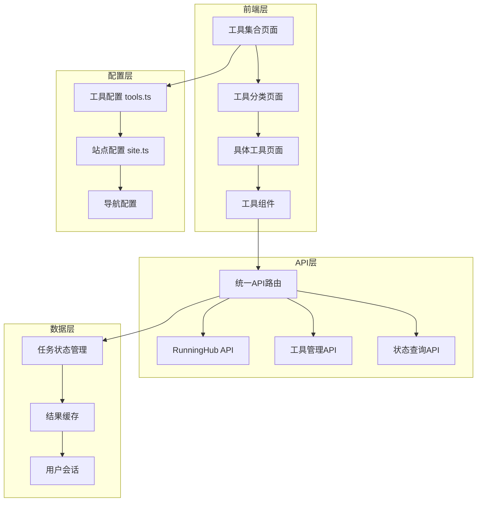

# 设计文档

## 概述

AI工具平台统一化功能的设计基于现有的FreeQwenImage项目架构，采用配置驱动的方式将分散的AI工具整合为统一的平台体验。设计遵循敏捷开发原则，保持现有功能稳定的同时，通过扩展和重构实现平台化目标。

该设计采用Next.js 15 App Router架构，结合TypeScript类型安全、Tailwind CSS样式系统和shadcn/ui组件库，构建高性能、可维护的AI工具集合平台。

## 架构

### 整体架构图



### 技术栈架构

- **前端框架**: Next.js 15 (App Router)
- **类型系统**: TypeScript 5.7+
- **样式系统**: Tailwind CSS 4.1+
- **UI组件**: shadcn/ui + Radix UI
- **状态管理**: React Hooks + Context API
- **国际化**: next-intl
- **部署平台**: Vercel

### 分层架构设计

1. **表现层 (Presentation Layer)**
   - 页面组件 (`src/app/[locale]/(default)/ai-tools/`)
   - UI组件 (`src/components/`)
   - 布局组件 (`src/components/blocks/`)

2. **业务逻辑层 (Business Logic Layer)**
   - 工具配置管理 (`src/config/tools.ts`)
   - 自定义Hooks (`src/hooks/`)
   - 工具管理器 (`src/lib/tools/`)

3. **数据访问层 (Data Access Layer)**
   - API路由 (`src/app/api/`)
   - 外部服务集成 (`src/lib/ai-providers/`)
   - 类型定义 (`src/types/`)

## 组件和接口

### 核心配置接口

```typescript
// 工具配置接口
export interface ToolConfig {
  id: string;                    // 工具唯一标识
  name: string;                  // 工具显示名称
  description: string;           // 工具描述
  category: 'image' | 'video' | 'audio' | 'text';
  href: string;                  // 页面路径
  apiEndpoint: string;           // API端点
  icon: {
    input: string;               // 输入图标
    output: string;              // 输出图标
  };
  component: string;             // 组件名称
  provider: string;              // AI提供商
  features: string[];            // 功能特性
  status: 'active' | 'beta' | 'coming-soon' | 'deprecated';
  pricing: 'free' | 'freemium' | 'pro';
  metadata: {
    version: string;
    createdAt: string;
    updatedAt: string;
    author: string;
  };
}
```

### 统一工具组件架构

```typescript
// 基础工具组件接口
export interface BaseToolProps {
  tool?: ToolConfig;
  className?: string;
  onResult?: (result: any) => void;
  onError?: (error: string) => void;
}

// 工具布局组件
export interface ToolLayoutProps {
  title: string;
  description: string;
  children: React.ReactNode;
  className?: string;
}

// 统一工具Hook接口
export interface UseAIToolReturn {
  execute: (params: any) => Promise<void>;
  isLoading: boolean;
  result: any;
  error: string | null;
  progress: number;
  reset: () => void;
}
```

### API接口设计

```typescript
// 统一API响应格式
export interface ApiResponse<T = any> {
  success: boolean;
  data?: T;
  error?: string;
  code?: number;
  message?: string;
}

// RunningHub任务响应
export interface TaskResponse {
  success: boolean;
  data: {
    taskId: string;
    status: 'pending' | 'running' | 'completed' | 'failed';
    progress?: number;
    resultUrl?: string;
    imageUrl?: string;
  };
  error?: string;
}

// 工具执行参数
export interface ToolExecuteParams {
  [key: string]: any;
  prompt?: string;
  image?: File | string;
  options?: Record<string, any>;
}
```

## 数据模型

### 工具配置数据模型

```typescript
// 当前已配置的工具
export const TOOLS_CONFIG: ToolConfig[] = [
  {
    id: 'text-to-image',
    name: 'Text to Image',
    description: 'Generate stunning images from text descriptions using advanced AI',
    category: 'image',
    href: '/ai-tools/image/text-to-image',
    apiEndpoint: '/api/runninghubAPI/text-to-image',
    icon: { input: '📝', output: '🖼️' },
    component: 'TextToImageTool',
    provider: 'runninghub',
    features: ['Multiple styles', 'High resolution', 'Fast generation'],
    status: 'active',
    pricing: 'free'
  },
  // ... 其他工具配置
];
```

### 任务状态数据模型

```typescript
// 任务状态管理
export interface TaskState {
  taskId: string;
  status: TaskStatus;
  progress: number;
  startTime: number;
  endTime?: number;
  result?: any;
  error?: string;
}

// 任务状态枚举
export type TaskStatus = 
  | 'PENDING' 
  | 'RUNNING' 
  | 'COMPLETED' 
  | 'SUCCESS' 
  | 'FAILED' 
  | 'ERROR';
```

### 用户会话数据模型

```typescript
// 用户会话状态
export interface UserSession {
  sessionId: string;
  activeTasks: TaskState[];
  history: TaskState[];
  preferences: {
    defaultSettings: Record<string, any>;
    favoriteTools: string[];
  };
}
```

## 错误处理

### 分层错误处理策略

1. **API层错误处理**
   ```typescript
   // API路由错误处理
   export async function POST(request: NextRequest) {
     try {
       // API逻辑
     } catch (error) {
       console.error('API Error:', error);
       return Response.json(
         { success: false, error: 'Internal server error' },
         { status: 500 }
       );
     }
   }
   ```

2. **组件层错误处理**
   ```typescript
   // 组件错误边界
   export function ToolErrorBoundary({ children }: { children: React.ReactNode }) {
     return (
       <ErrorBoundary
         fallback={<ToolErrorFallback />}
         onError={(error) => console.error('Tool Error:', error)}
       >
         {children}
       </ErrorBoundary>
     );
   }
   ```

3. **Hook层错误处理**
   ```typescript
   // 统一错误处理Hook
   export function useAITool(toolId: string) {
     const [error, setError] = useState<string | null>(null);
     
     const handleError = (err: any) => {
       const errorMessage = err?.message || 'An unexpected error occurred';
       setError(errorMessage);
       toast.error(errorMessage);
     };
     
     // ... 其他逻辑
   }
   ```

### 错误类型定义

```typescript
// 错误类型枚举
export enum ErrorType {
  VALIDATION_ERROR = 'VALIDATION_ERROR',
  API_ERROR = 'API_ERROR',
  NETWORK_ERROR = 'NETWORK_ERROR',
  TIMEOUT_ERROR = 'TIMEOUT_ERROR',
  UNKNOWN_ERROR = 'UNKNOWN_ERROR'
}

// 错误信息接口
export interface ErrorInfo {
  type: ErrorType;
  message: string;
  details?: any;
  timestamp: number;
  toolId?: string;
  taskId?: string;
}
```

## 测试策略

### 测试架构

1. **单元测试**
   - 工具配置验证
   - API响应格式验证
   - 组件渲染测试
   - Hook功能测试

2. **集成测试**
   - API端点测试
   - 工具流程测试
   - 错误处理测试

3. **端到端测试**
   - 用户工作流测试
   - 跨工具导航测试
   - 性能测试

### 测试工具和脚本

```javascript
// API测试脚本 (scripts/test-api.js)
const testEndpoints = [
  '/api/runninghubAPI/text-to-image',
  '/api/runninghubAPI/image-to-image',
  '/api/runninghubAPI/image-enhancer',
  '/api/runninghubAPI/image-to-video'
];

async function testAPI(endpoint) {
  try {
    const response = await fetch(`http://localhost:3000${endpoint}`, {
      method: 'POST',
      headers: { 'Content-Type': 'application/json' },
      body: JSON.stringify({ prompt: 'test prompt' })
    });
    
    const result = await response.json();
    console.log(`✅ ${endpoint}: ${result.success ? 'PASS' : 'FAIL'}`);
  } catch (error) {
    console.log(`❌ ${endpoint}: ERROR - ${error.message}`);
  }
}
```

### 性能测试指标

- **页面加载时间**: < 2秒
- **API响应时间**: < 500ms (初始请求)
- **图像生成时间**: 10-30秒 (取决于复杂度)
- **内存使用**: < 100MB (客户端)
- **并发处理**: 支持100+并发用户

## 实现细节

### 页面路由结构

```
src/app/[locale]/(default)/
├── ai-tools/
│   ├── page.tsx                    # 工具集合页面
│   ├── image/
│   │   ├── text-to-image/
│   │   │   └── page.tsx           # 文生图页面
│   │   ├── image-to-image/
│   │   │   └── page.tsx           # 图生图页面
│   │   ├── image-enhancer/
│   │   │   └── page.tsx           # 图像增强页面
│   │   └── page.tsx               # 图像工具分类页
│   ├── video/
│   │   ├── image-to-video/
│   │   │   └── page.tsx           # 图生视频页面
│   │   └── page.tsx               # 视频工具分类页
│   └── _components/               # 工具页面专用组件
│       ├── tool-card.tsx
│       ├── tool-grid.tsx
│       ├── tool-navigation.tsx
│       └── category-filter.tsx
```

### API路由结构

```
src/app/api/
├── runninghubAPI/                 # RunningHub API集成
│   ├── text-to-image/route.ts    # 文生图API
│   ├── image-to-image/route.ts   # 图生图API
│   ├── image-enhancer/route.ts   # 图像增强API (现有)
│   ├── image-to-video/route.ts   # 图生视频API
│   ├── upload/route.ts           # 文件上传API (现有)
│   └── status/route.ts           # 状态查询API (现有)
├── tools/                        # 工具管理API
│   ├── list/route.ts             # 工具列表
│   ├── [toolId]/route.ts         # 工具详情
│   └── categories/route.ts       # 工具分类
└── analytics/                    # 统计分析API
    ├── usage/route.ts            # 使用统计
    └── health/route.ts           # 健康检查
```

### 组件结构

```
src/components/
├── tools/                        # 工具组件
│   ├── _base/                    # 基础组件
│   │   ├── tool-layout.tsx       # 工具布局
│   │   ├── tool-error.tsx        # 错误处理
│   │   └── tool-loading.tsx      # 加载状态
│   ├── text-to-image/            # 文生图组件
│   │   └── text-to-image-tool.tsx
│   ├── image-to-image/           # 图生图组件
│   │   └── image-to-image-tool.tsx
│   ├── image-enhancer/           # 图像增强组件
│   │   └── image-enhancer-tool.tsx
│   └── image-to-video/           # 图生视频组件
│       └── image-to-video-tool.tsx
├── ai-tools/                     # AI工具平台组件
│   ├── tool-navigation.tsx       # 工具导航
│   ├── tool-card.tsx            # 工具卡片
│   ├── tool-grid.tsx            # 工具网格
│   └── category-filter.tsx       # 分类筛选
└── blocks/                       # 页面区块组件
    ├── hero/                     # Hero区块
    ├── content/                  # 内容区块
    ├── faq/                      # FAQ区块
    └── cta/                      # CTA区块
```

### 状态管理架构

```typescript
// 全局状态管理 (src/contexts/app-context.tsx)
export interface AppState {
  currentTool: string | null;
  activeTasks: TaskState[];
  userPreferences: UserPreferences;
  toolsConfig: ToolConfig[];
}

// 工具状态管理Hook (src/hooks/use-ai-tool.ts)
export function useAITool(toolId: string) {
  const [state, setState] = useState({
    isLoading: false,
    result: null,
    error: null,
    progress: 0
  });

  const execute = async (params: ToolExecuteParams) => {
    setState(prev => ({ ...prev, isLoading: true, error: null }));
    
    try {
      const tool = getToolById(toolId);
      const response = await fetch(tool.apiEndpoint, {
        method: 'POST',
        headers: { 'Content-Type': 'application/json' },
        body: JSON.stringify(params)
      });

      const result = await response.json();
      
      if (result.success && result.data?.taskId) {
        await pollTaskStatus(result.data.taskId);
      } else {
        setState(prev => ({ ...prev, result: result.data, isLoading: false }));
      }
    } catch (error) {
      setState(prev => ({ ...prev, error: error.message, isLoading: false }));
    }
  };

  return { ...state, execute, reset: () => setState(initialState) };
}
```

### 配置驱动架构

```typescript
// 工具配置管理 (src/lib/tools/manager.ts)
export class ToolManager {
  private static instance: ToolManager;
  private tools: Map<string, ToolConfig> = new Map();

  static getInstance(): ToolManager {
    if (!ToolManager.instance) {
      ToolManager.instance = new ToolManager();
    }
    return ToolManager.instance;
  }

  loadTools(configs: ToolConfig[]) {
    configs.forEach(config => {
      this.tools.set(config.id, config);
    });
  }

  getTool(id: string): ToolConfig | undefined {
    return this.tools.get(id);
  }

  getToolsByCategory(category: string): ToolConfig[] {
    return Array.from(this.tools.values())
      .filter(tool => tool.category === category);
  }

  getActiveTools(): ToolConfig[] {
    return Array.from(this.tools.values())
      .filter(tool => tool.status === 'active');
  }
}
```

### 国际化支持

```typescript
// 国际化配置 (src/i18n/config.ts)
export const locales = ['en', 'zh', 'ja', 'ko'] as const;
export type Locale = typeof locales[number];

// 工具内容国际化 (src/i18n/tools/text-to-image.json)
{
  "en": {
    "title": "Text to Image Generator",
    "description": "Generate stunning images from text descriptions",
    "placeholder": "Describe the image you want to create...",
    "generate": "Generate Image",
    "tips": {
      "title": "Tips for better results",
      "items": [
        "Be specific about style, colors, and composition",
        "Include quality keywords like 'high quality', 'detailed'",
        "Mention the type of shot: 'close-up', 'wide angle'"
      ]
    }
  },
  "zh": {
    "title": "文生图生成器",
    "description": "通过文字描述生成精美图像",
    "placeholder": "描述您想要创建的图像...",
    "generate": "生成图像",
    "tips": {
      "title": "获得更好结果的技巧",
      "items": [
        "具体描述风格、颜色和构图",
        "包含质量关键词如'高质量'、'详细'",
        "提及拍摄类型：'特写'、'广角'"
      ]
    }
  }
}
```

这个设计文档提供了完整的技术架构方案，基于现有的代码结构和最佳实践，确保了系统的可扩展性、可维护性和性能表现。