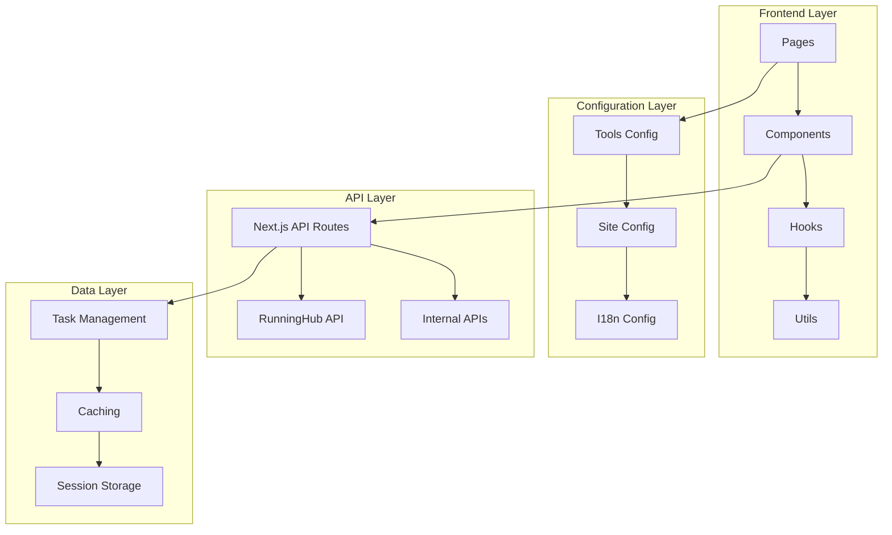

# Developer Guide

This guide provides comprehensive information for developers working on the FreeQwenImage AI Tools Platform.

## 🏗 Architecture Overview

### System Architecture

The platform follows a modular, configuration-driven architecture:



### Key Design Principles

1. **Configuration-Driven**: Tools are defined in configuration files, making it easy to add new tools
2. **Component Reusability**: Shared components and patterns across all tools
3. **Type Safety**: Full TypeScript coverage with strict type checking
4. **Performance First**: Optimized for speed with lazy loading and caching
5. **Mobile First**: Responsive design with mobile-optimized interactions

## 🛠 Development Setup

### Prerequisites

- Node.js 18.17.0 or later
- pnpm 8.0.0 or later (recommended)
- Git

### Environment Setup

1. **Clone and Install**
```bash
git clone <repository-url>
cd freeqwenimage
pnpm install
```

2. **Environment Configuration**
```bash
cp .env.example .env.development
```

Required environment variables:
```env
# RunningHub API
RUNNINGHUB_API_URL=https://api.runninghub.ai
RUNNINGHUB_API_KEY=your_api_key

# Next.js
NEXTAUTH_SECRET=your_secret_key
NEXTAUTH_URL=http://localhost:3000

# Optional: Analytics
NEXT_PUBLIC_GA_ID=your_ga_id
```

3. **Development Server**
```bash
pnpm dev
```

### Development Scripts

```bash
# Development
pnpm dev              # Start development server
pnpm build            # Build for production
pnpm start            # Start production server

# Testing
pnpm test             # Run unit tests
pnpm test:watch       # Run tests in watch mode
pnpm test:e2e         # Run end-to-end tests
pnpm test:api         # Test API endpoints

# Code Quality
pnpm lint             # Run ESLint
pnpm lint:fix         # Fix ESLint issues
pnpm type-check       # TypeScript type checking
pnpm format           # Format code with Prettier

# Utilities
pnpm analyze          # Bundle analyzer
pnpm clean            # Clean build artifacts
```

## 🔧 Adding New AI Tools

### Step 1: Tool Configuration

Add your tool to `src/config/tools.ts`:

```typescript
export const TOOLS_CONFIG: ToolConfig[] = [
  // ... existing tools
  {
    id: 'your-new-tool',
    name: 'Your New Tool',
    description: 'Description of what your tool does',
    category: 'image', // 'image' | 'video' | 'audio' | 'text'
    href: '/ai-tools/image/your-new-tool',
    apiEndpoint: '/api/runninghubAPI/your-new-tool',
    icon: {
      input: '📝',  // Input icon emoji
      output: '🖼️' // Output icon emoji
    },
    component: 'YourNewToolComponent',
    provider: 'runninghub',
    features: ['Feature 1', 'Feature 2', 'Feature 3'],
    status: 'active', // 'active' | 'beta' | 'coming-soon' | 'deprecated'
    pricing: 'free', // 'free' | 'freemium' | 'pro'
    metadata: {
      version: '1.0.0',
      createdAt: new Date().toISOString(),
      updatedAt: new Date().toISOString(),
      author: 'Your Name'
    }
  }
];
```

### Step 2: API Route

Create `src/app/api/runninghubAPI/your-new-tool/route.ts`:

```typescript
import { NextRequest } from 'next/server';
import { ApiResponse, TaskResponse } from '@/types/runninghub';

export async function POST(request: NextRequest): Promise<Response> {
  try {
    const body = await request.json();
    
    // Validate input
    if (!body.prompt) {
      return Response.json(
        { success: false, error: 'Prompt is required' },
        { status: 400 }
      );
    }

    // Call RunningHub API
    const response = await fetch(`${process.env.RUNNINGHUB_API_URL}/your-endpoint`, {
      method: 'POST',
      headers: {
        'Content-Type': 'application/json',
        'Authorization': `Bearer ${process.env.RUNNINGHUB_API_KEY}`
      },
      body: JSON.stringify({
        node_id: 'your_node_id', // Get from RunningHub
        prompt: body.prompt,
        // ... other parameters
      })
    });

    const result = await response.json();

    if (!response.ok) {
      return Response.json(
        { success: false, error: result.message || 'API request failed' },
        { status: response.status }
      );
    }

    return Response.json({
      success: true,
      data: {
        taskId: result.task_id,
        status: 'pending'
      }
    } as ApiResponse<TaskResponse>);

  } catch (error) {
    console.error('API Error:', error);
    return Response.json(
      { success: false, error: 'Internal server error' },
      { status: 500 }
    );
  }
}
```

### Step 3: Tool Component

Create `src/components/tools/your-new-tool/your-new-tool.tsx`:

```typescript
'use client';

import { useState } from 'react';
import { useAITool } from '@/hooks/use-ai-tool';
import { ToolLayout } from '@/components/tools/_base/tool-layout';
import { Button } from '@/components/ui/button';
import { Textarea } from '@/components/ui/textarea';
import { Card } from '@/components/ui/card';

interface YourNewToolProps {
  className?: string;
}

export function YourNewTool({ className }: YourNewToolProps) {
  const [prompt, setPrompt] = useState('');
  const { execute, isLoading, result, error, progress } = useAITool('your-new-tool');

  const handleSubmit = async () => {
    if (!prompt.trim()) return;
    
    await execute({
      prompt: prompt.trim(),
      // ... other parameters
    });
  };

  return (
    <ToolLayout
      title="Your New Tool"
      description="Description of what your tool does"
      className={className}
    >
      <div className="space-y-6">
        {/* Input Section */}
        <Card className="p-6">
          <div className="space-y-4">
            <div>
              <label className="block text-sm font-medium mb-2">
                Enter your prompt
              </label>
              <Textarea
                value={prompt}
                onChange={(e) => setPrompt(e.target.value)}
                placeholder="Describe what you want to create..."
                className="min-h-[100px]"
              />
            </div>
            
            <Button
              onClick={handleSubmit}
              disabled={isLoading || !prompt.trim()}
              className="w-full"
            >
              {isLoading ? `Processing... ${progress}%` : 'Generate'}
            </Button>
          </div>
        </Card>

        {/* Results Section */}
        {result && (
          <Card className="p-6">
            <h3 className="text-lg font-semibold mb-4">Result</h3>
            {/* Display your result here */}
            <div className="space-y-4">
              {result.imageUrl && (
                
              )}
            </div>
          </Card>
        )}

        {/* Error Display */}
        {error && (
          <Card className="p-6 border-red-200 bg-red-50">
            <p className="text-red-600">{error}</p>
          </Card>
        )}
      </div>
    </ToolLayout>
  );
}
```

### Step 4: Page Component

Create `src/app/[locale]/(default)/ai-tools/image/your-new-tool/page.tsx`:

```typescript
import { Metadata } from 'next';
import { YourNewTool } from '@/components/tools/your-new-tool/your-new-tool';
import { ToolNavigation } from '@/components/ai-tools/tool-navigation';

export const metadata: Metadata = {
  title: 'Your New Tool - AI Tools Platform',
  description: 'Description of what your tool does',
  keywords: ['AI', 'tool', 'your', 'keywords'],
};

export default function YourNewToolPage() {
  return (
    <div className="container mx-auto px-4 py-8">
      <YourNewTool />
      <ToolNavigation currentTool="your-new-tool" className="mt-12" />
    </div>
  );
}
```

### Step 5: Internationalization

Add translations in `src/i18n/tools/your-new-tool.json`:

```json
{
  "en": {
    "title": "Your New Tool",
    "description": "Description in English",
    "placeholder": "Enter your prompt...",
    "generate": "Generate",
    "tips": {
      "title": "Tips for better results",
      "items": [
        "Tip 1",
        "Tip 2",
        "Tip 3"
      ]
    }
  },
  "zh": {
    "title": "您的新工具",
    "description": "中文描述",
    "placeholder": "输入您的提示...",
    "generate": "生成",
    "tips": {
      "title": "获得更好结果的技巧",
      "items": [
        "技巧1",
        "技巧2", 
        "技巧3"
      ]
    }
  }
}
```

## 🧪 Testing Guidelines

### Unit Testing

Create tests in `src/components/tools/your-new-tool/__tests__/`:

```typescript
import { render, screen, fireEvent, waitFor } from '@testing-library/react';
import { YourNewTool } from '../your-new-tool';

// Mock the useAITool hook
jest.mock('@/hooks/use-ai-tool');

describe('YourNewTool', () => {
  it('renders correctly', () => {
    render(<YourNewTool />);
    expect(screen.getByText('Your New Tool')).toBeInTheDocument();
  });

  it('handles form submission', async () => {
    const mockExecute = jest.fn();
    (useAITool as jest.Mock).mockReturnValue({
      execute: mockExecute,
      isLoading: false,
      result: null,
      error: null,
      progress: 0
    });

    render(<YourNewTool />);
    
    const textarea = screen.getByPlaceholderText('Describe what you want to create...');
    const button = screen.getByText('Generate');

    fireEvent.change(textarea, { target: { value: 'test prompt' } });
    fireEvent.click(button);

    await waitFor(() => {
      expect(mockExecute).toHaveBeenCalledWith({
        prompt: 'test prompt'
      });
    });
  });
});
```

### API Testing

Add API tests to `scripts/test-api.js`:

```javascript
async function testYourNewTool() {
  try {
    const response = await fetch('http://localhost:3000/api/runninghubAPI/your-new-tool', {
      method: 'POST',
      headers: { 'Content-Type': 'application/json' },
      body: JSON.stringify({ prompt: 'test prompt' })
    });

    const result = await response.json();
    console.log(`✅ Your New Tool API: ${result.success ? 'PASS' : 'FAIL'}`);
    
    if (!result.success) {
      console.log(`   Error: ${result.error}`);
    }
  } catch (error) {
    console.log(`❌ Your New Tool API: ERROR - ${error.message}`);
  }
}
```

### E2E Testing

Add E2E tests in `e2e/your-new-tool.spec.ts`:

```typescript
import { test, expect } from '@playwright/test';

test.describe('Your New Tool', () => {
  test('should generate content successfully', async ({ page }) => {
    await page.goto('/ai-tools/image/your-new-tool');
    
    // Fill in the prompt
    await page.fill('textarea[placeholder*="Describe what you want"]', 'test prompt');
    
    // Click generate button
    await page.click('button:has-text("Generate")');
    
    // Wait for result
    await expect(page.locator('[data-testid="result"]')).toBeVisible({ timeout: 30000 });
  });
});
```

## 🎨 Styling Guidelines

### Component Styling

Use Tailwind CSS with consistent patterns:

```typescript
// Good: Consistent spacing and responsive design
<div className="space-y-6 p-4 md:p-6">
  <Card className="p-6 border border-gray-200 rounded-lg shadow-sm">
    <h3 className="text-lg font-semibold text-gray-900 mb-4">Title</h3>
    <p className="text-gray-600 text-sm">Description</p>
  </Card>
</div>

// Bad: Inconsistent spacing and no responsive design
<div className="p-2">
  <div className="border p-3">
    <h3 className="text-xl font-bold">Title</h3>
    <p>Description</p>
  </div>
</div>
```

### Color Scheme

Use the defined color palette:

```css
/* Primary colors */
--primary: 222.2 84% 4.9%;
--primary-foreground: 210 40% 98%;

/* Secondary colors */
--secondary: 210 40% 96%;
--secondary-foreground: 222.2 84% 4.9%;

/* Accent colors */
--accent: 210 40% 96%;
--accent-foreground: 222.2 84% 4.9%;
```

### Responsive Design

Follow mobile-first approach:

```typescript
// Mobile-first responsive classes
<div className="grid grid-cols-1 md:grid-cols-2 lg:grid-cols-3 gap-4">
  <Card className="p-4 md:p-6">
    <h3 className="text-base md:text-lg font-semibold">Title</h3>
  </Card>
</div>
```

## 🔍 Debugging

### Common Issues

1. **API Connection Issues**
```bash
# Check API endpoints
pnpm test:api

# Verify environment variables
echo $RUNNINGHUB_API_KEY
```

2. **Build Issues**
```bash
# Clear cache and rebuild
rm -rf .next node_modules
pnpm install
pnpm build
```

3. **Type Errors**
```bash
# Run type checking
pnpm type-check

# Generate types
pnpm generate-types
```

### Development Tools

- **React DevTools**: Browser extension for React debugging
- **Next.js DevTools**: Built-in development tools
- **TypeScript Language Server**: VS Code extension for TypeScript support
- **Tailwind CSS IntelliSense**: VS Code extension for Tailwind CSS

### Logging

Use structured logging:

```typescript
// Good: Structured logging
console.log('API Request:', {
  endpoint: '/api/your-endpoint',
  method: 'POST',
  timestamp: new Date().toISOString(),
  data: sanitizedData
});

// Bad: Unstructured logging
console.log('calling api with data', data);
```

## 📊 Performance Guidelines

### Code Splitting

Use dynamic imports for large components:

```typescript
import dynamic from 'next/dynamic';

const YourNewTool = dynamic(
  () => import('@/components/tools/your-new-tool/your-new-tool'),
  {
    loading: () => <ToolSkeleton />,
    ssr: false
  }
);
```

### Image Optimization

Use Next.js Image component:

```typescript
import Image from 'next/image';

<Image
  src={result.imageUrl}
  alt="Generated result"
  width={800}
  height={600}
  className="rounded-lg"
  priority={false}
  placeholder="blur"
  blurDataURL="data:image/jpeg;base64,..."
/>
```

### API Optimization

Implement caching and error handling:

```typescript
// Cache API responses
const cache = new Map();

export async function cachedApiCall(key: string, apiCall: () => Promise<any>) {
  if (cache.has(key)) {
    return cache.get(key);
  }
  
  const result = await apiCall();
  cache.set(key, result);
  
  // Clear cache after 5 minutes
  setTimeout(() => cache.delete(key), 5 * 60 * 1000);
  
  return result;
}
```

## 🚀 Deployment

### Pre-deployment Checklist

- [ ] All tests passing
- [ ] TypeScript compilation successful
- [ ] Environment variables configured
- [ ] Performance benchmarks met
- [ ] Security audit completed
- [ ] Documentation updated

### Environment-specific Configurations

```typescript
// next.config.mjs
const nextConfig = {
  // Production optimizations
  experimental: {
    optimizeCss: true,
    optimizePackageImports: ['@radix-ui/react-icons']
  },
  
  // Image optimization
  images: {
    domains: ['your-image-domain.com'],
    formats: ['image/webp', 'image/avif']
  },
  
  // Security headers
  async headers() {
    return [
      {
        source: '/(.*)',
        headers: [
          {
            key: 'X-Frame-Options',
            value: 'DENY'
          },
          {
            key: 'X-Content-Type-Options',
            value: 'nosniff'
          }
        ]
      }
    ];
  }
};
```

This developer guide provides comprehensive information for working with the AI Tools Platform. For specific implementation details, refer to the existing codebase and follow the established patterns.