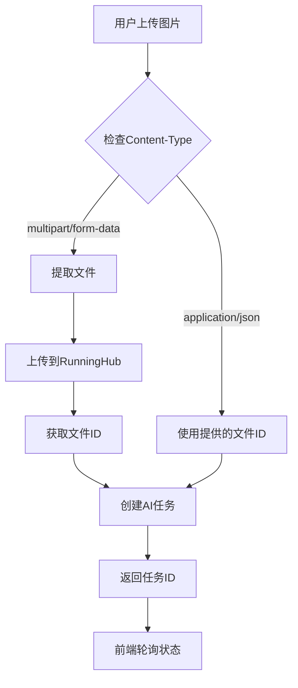

# RunningHub API 集成更新报告

## 概述

根据 RunningHub API 指南文档，已对图像去水印和抠图两个API进行了重大更新，确保完全符合官方API规范。

## 主要更新内容

### 1. API 流程重构

**之前的错误实现：**
- 直接使用文件名作为参数
- 跳过了文件上传步骤

**新的正确实现：**
1. **文件上传** → 使用 `/task/openapi/upload` 端点
2. **任务创建** → 使用返回的完整文件ID
3. **状态查询** → 使用 `/task/openapi/status` 端点  
4. **结果获取** → 使用 `/task/openapi/outputs` 端点

### 2. 更新的API端点

#### 图像去水印 API
- **路径**: `/api/runninghubAPI/image-effects`
- **webappId**: `1955923521295798274`
- **nodeId**: `220`

#### 抠图 API  
- **路径**: `/api/runninghubAPI/background-removal`
- **webappId**: `1956630770939035649`
- **nodeId**: `3`

### 3. 支持的请求格式

#### 方式一：直接文件上传（推荐）
```javascript
// 前端发送FormData
const formData = new FormData()
formData.append('file', uploadedImage)

fetch('/api/runninghubAPI/image-effects', {
  method: 'POST',
  body: formData
})
```

#### 方式二：使用已上传文件ID
```javascript
// 使用已上传的文件ID
fetch('/api/runninghubAPI/image-effects', {
  method: 'POST',
  headers: { 'Content-Type': 'application/json' },
  body: JSON.stringify({
    image: "api/570626eea496318dabfcce26c1d5514e1c9089074e18a32a139e97939bbc75a4.png"
  })
})
```

### 4. API 处理流程



### 5. 前端组件更新

- **智能路由**: 图生图应用自动发送FormData，文生图应用发送JSON
- **文件处理**: 支持图片预览、删除、重新上传
- **错误处理**: 完整的上传和处理错误处理

### 6. 关键改进点

#### 文件ID处理
- **保留完整路径**: 包含 `api/` 前缀的完整文件ID
- **错误示例**: `570626eea496318dabfcce26c1d5514e1c9089074e18a32a139e97939bbc75a4.png`
- **正确示例**: `api/570626eea496318dabfcce26c1d5514e1c9089074e18a32a139e97939bbc75a4.png`

#### 错误处理
- **上传失败**: 检查 `uploadResult.code === 0`
- **任务失败**: 检查 `submitResult.code === 0`
- **状态查询**: 正确解析状态字符串
- **结果获取**: 正确提取图像URL

#### API端点确认
- ✅ 上传: `/task/openapi/upload` (不是 `/task/openapi/file/upload`)
- ✅ 状态: `/task/openapi/status` (不是 `/task/openapi/task/status`)
- ✅ 结果: `/task/openapi/outputs` (不是 `/task/openapi/result`)

### 7. 测试文件更新

- **图像去水印**: `debug/image-effects-api-test.http`
- **抠图处理**: `debug/background-removal-api-test.http`

每个测试文件都包含：
- 文件上传测试
- 已有文件ID测试
- 状态查询测试
- 直接RunningHub API测试

### 8. 兼容性保证

- **向后兼容**: 仍支持JSON格式的文件ID请求
- **前向兼容**: 完全支持官方推荐的文件上传流程
- **错误降级**: 文件上传失败时提供明确错误信息

## 验证清单

- [x] 文件上传使用正确的API端点
- [x] 保留完整的文件ID路径
- [x] 正确处理API响应格式
- [x] 实现完整的错误处理
- [x] 更新前端组件支持FormData
- [x] 创建详细的测试用例
- [x] 保持向后兼容性

## 总结

此次更新确保了与RunningHub官方API的完全兼容，提供了更稳定和可靠的图像处理服务。用户现在可以直接上传图片进行处理，无需手动处理文件上传和ID管理。

